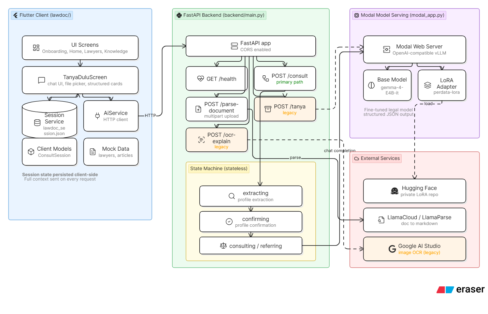

# LawDoc

Private, practical legal literacy and civil-law triage for Indonesians who need a starting point before they can reach a lawyer.

LawDoc is built for the [Kaggle and Google DeepMind Gemma 4 Good Hackathon](https://www.kaggle.com/competitions/gemma-4-good-hackathon/overview). The project targets two hackathon tracks:

- **Future of Education**: LawDoc teaches users how Indonesian civil-law processes work in plain language, adapting explanations to their religion, domicile, budget, case type, and uploaded documents.
- **Unsloth Track**: LawDoc uses a Gemma 4 LoRA fine-tune trained with Unsloth for Indonesian civil-law reasoning, served through Modal/vLLM as `perdata-lora`.

LawDoc is not an AI lawyer and does not provide official legal advice. It is a guided triage and legal education tool that helps users understand likely legal routes, required documents, next steps, and when to contact a lawyer or legal aid organization.

## Why LawDoc Exists

Many Indonesians face inheritance, divorce, debt, land, and document problems without easy access to affordable legal help. The first barrier is often not court representation; it is understanding what the problem is, which institution handles it, what documents are needed, and what a realistic next step looks like.

LawDoc turns a legal question or uploaded document into:

- A plain-language explanation of the user's situation.
- A relevant legal basis and concrete application to the user's facts.
- A checklist of documents to prepare.
- Step-by-step next actions.
- A realistic outcome and timeline.
- A referral recommendation when the case is too complex for self-guided triage.

## Current Status

This repository is an MVP/prototype with a working Flutter client, FastAPI backend, Modal/vLLM model-serving definition, document parsing endpoint, test prompts, and mock domain data.

Implemented:

- Flutter Android/Web app with onboarding, chat, lawyer browsing, pro-bono screen, and knowledge base.
- Main `/consult` chatbot flow with a stateless backend state machine.
- Client-side session persistence in `lawdoc_session.json`.
- Fine-tuned Gemma 4 LoRA path through Modal/vLLM.
- Document upload parsing through LlamaParse before consultation.
- Structured AI response rendering in the chat UI.
- Legacy `/tanya` and `/ocr-explain` endpoints preserved for compatibility.
- Test prompts and sample legal documents under `testcases/`.

Not production-ready:

- Lawyer and article data are local mocks.
- There is no backend database or authentication.
- Legal aid/pro-bono routing is not connected to a real LBH/PERADI directory.
- `/ocr-explain` is a legacy endpoint and is not the primary document flow.
- The app is a legal education and triage tool, not a substitute for a lawyer.

## Architecture



## Runtime Flow

1. The user opens the Flutter app and enters the Tanya Dulu chat.
2. `SessionService` loads or creates a `ConsultSession`.
3. The user sends a message and optionally attaches a document.
4. If a file is attached, Flutter sends it to `/parse-document`; the backend uses LlamaParse to return clean text.
5. Flutter sends the message, session context, chat history, and optional document text to `/consult`.
6. FastAPI routes the request by `flow_state`:
   - `extracting`: ask the model to infer religion, domicile, and budget.
   - `confirming`: ask the user to confirm or correct the detected profile.
   - `consulting`: ask the model for structured legal analysis.
   - `referring`: continue consultation while showing a lawyer referral recommendation.
7. Flutter renders the model response as chat text plus structured cards for legal basis, document checklist, next steps, outcome, and referral.
8. Flutter persists the updated session locally.

## Tech Stack

| Layer | Technology |
|---|---|
| Client | Flutter, Dart |
| Navigation | GoRouter with ShellRoute bottom navigation |
| Styling | Custom theme, `google_fonts` |
| Client storage | `path_provider` local JSON file |
| Backend | FastAPI, Pydantic, Uvicorn |
| Model client | `huggingface_hub.InferenceClient` |
| Model serving | Modal web server with vLLM |
| Base model | `unsloth/gemma-4-E4B-it` |
| Fine-tune | `sirpratama/perdata-gemma4-lora-v2` |
| Fine-tuning track | Unsloth |
| Document parsing | LlamaCloud / LlamaParse |
| Legacy OCR | Google AI Studio / Gemini image OCR |

## Repository Layout

```text
.
|-- README.md
|-- modal_app.py
|-- legal_consultant_ai_flow_v2.mmd
|-- backend/
|   |-- main.py
|   |-- requirements.txt
|   |-- .env.example
|   |-- setup.sh
|   |-- setup.ps1
|   |-- start.sh
|   `-- start.ps1
|-- lawdoc/
|   |-- pubspec.yaml
|   |-- lib/
|   |   |-- main.dart
|   |   |-- app.dart
|   |   |-- models/
|   |   |-- services/
|   |   |-- screens/
|   |   |-- widgets/
|   |   |-- theme/
|   |   |-- data/
|   |   `-- l10n/
|   |-- assets/data/kuhperdata.json
|   |-- test/
|   |-- android/
|   `-- web/
`-- testcases/
    |-- prompts.md
    `-- documents/
```

## Key Files

| File | Why it matters |
|---|---|
| `backend/main.py` | FastAPI app, `/consult` state machine, prompts, JSON extraction, document parsing, legacy endpoints |
| `modal_app.py` | Modal/vLLM deployment for the Gemma 4 base model plus LoRA adapter |
| `lawdoc/lib/services/ai_service.dart` | Flutter HTTP integration for health checks, consultation, parsing, and legacy Q&A |
| `lawdoc/lib/services/session_service.dart` | Local session persistence through `lawdoc_session.json` |
| `lawdoc/lib/models/consult_session.dart` | Client session, context, and `/consult` response models |
| `lawdoc/lib/models/legal_response.dart` | Shared legal response and structured consultation card models |
| `lawdoc/lib/screens/chat/tanya_dulu_screen.dart` | Main chat UI, file picker, context bar, structured answer cards |
| `legal_consultant_ai_flow_v2.mmd` | Domain decision tree for legal triage routing |
| `testcases/prompts.md` | Manual prompt set for inheritance, divorce, debt, land, and edge cases |

## Backend API

### `GET /health`

Returns service status, model name, and API version.

```json
{
  "status": "ok",
  "model": "sirpratama/perdata-gemma4-lora-v2",
  "version": "2.1.0"
}
```

### `POST /consult`

Primary chatbot endpoint. The backend is stateless; the client sends the full session context and history each time.

Request:

```json
{
  "session_id": "session-id",
  "message": "Saya ingin bertanya soal warisan keluarga.",
  "document_text": "optional parsed document text",
  "context": {
    "agama": "Islam",
    "domicile": "Jakarta",
    "budget": "pro_bono",
    "case_type": null,
    "confirmed": false,
    "flow_state": "extracting"
  },
  "history": [
    { "role": "user", "content": "..." },
    { "role": "model", "content": "..." }
  ]
}
```

Response:

```json
{
  "message": "Natural-language response in Indonesian.",
  "flow_state": "consulting",
  "context_update": {
    "agama": "Islam",
    "domicile": "Jakarta",
    "budget": "pro_bono",
    "case_type": "warisan",
    "confirmed": true,
    "flow_state": "consulting"
  },
  "structured": {
    "legal_basis": {
      "pasal": "KUHPerdata Pasal ...",
      "text": "Quoted legal text",
      "application": "How the rule applies to this user's facts"
    },
    "docs_needed": ["KTP", "Kartu Keluarga"],
    "steps": ["Step 1", "Step 2"],
    "outcome": "Likely result and timeline",
    "refer_to_lawyer": false
  },
  "disclaimer": "Jawaban ini bersifat informasi umum..."
}
```

### `POST /parse-document`

Uploads a document as `multipart/form-data` under field name `file`. The backend validates file type and size, sends it to LlamaParse, and returns markdown/text for `/consult`.

Supported extensions include PDF, DOCX, DOC, PPTX, XLSX, TXT, MD, RTF, HTML, ODT, EPUB, PNG, JPG, WEBP, BMP, GIF, and TIFF. Maximum upload size is 15 MB.

Response:

```json
{
  "text": "# Parsed document markdown...",
  "filename": "contract.pdf",
  "char_count": 1234
}
```

### Legacy endpoints

| Endpoint | Status | Notes |
|---|---|---|
| `POST /tanya` | Legacy | Simple Q&A schema retained for compatibility and tests |
| `POST /ocr-explain` | Legacy | Uses Google AI Studio for image text extraction, then the legal model for analysis |

## State Machine

The `/consult` endpoint uses a stateless state machine. Flutter owns the session and sends `flow_state`, context, and history on every request.

| Current state | Trigger | Next state | What happens |
|---|---|---|---|
| `extracting` | Missing religion, domicile, or budget | `extracting` | The model asks one natural follow-up question. |
| `extracting` | All profile fields detected | `confirming` | Backend asks the user to confirm the detected profile. |
| `confirming` | User corrects profile | `extracting` | Backend re-runs extraction with the corrected information. |
| `confirming` | User confirms profile | `consulting` | Backend calls the model for full legal analysis. |
| `consulting` | Continued legal question | `consulting` | Backend returns updated structured guidance. |
| `consulting` | Model sets `refer_to_lawyer` | `referring` | Chat displays a lawyer referral recommendation. |
| `referring` | User continues conversation | `consulting` | Backend continues legal analysis with existing context. |

## Environment Variables

Copy `backend/.env.example` to `backend/.env` and fill what you need.

| Variable | Required | Purpose |
|---|---:|---|
| `HF_API_KEY` | Yes for live model | Hugging Face token with read access to the private LoRA repo |
| `HF_ENDPOINT_URL` | Yes for live model | Modal/vLLM OpenAI-compatible endpoint URL |
| `HF_LORA_ADAPTER_NAME` | Yes | Adapter name exposed by vLLM, default `perdata-lora` |
| `LLAMA_CLOUD_API_KEY` | Yes for file upload | Enables `/parse-document` through LlamaParse |
| `GOOGLE_API_KEY` | Optional | Only needed for legacy `/ocr-explain` image OCR |
| `API_BASE_URL` | Optional Flutter define | Overrides Flutter backend URL; default is `http://localhost:8000` |

Never commit `backend/.env`.

## Quick Start

### Prerequisites

- Flutter 3.x
- Dart SDK matching the Flutter install
- Python 3.10+
- Java 21 for Android builds
- Hugging Face token with access to `sirpratama/perdata-gemma4-lora-v2`
- LlamaCloud API key for document parsing
- Modal account for live model serving

### 1. Install backend dependencies

PowerShell:

```powershell
cd backend
python -m venv .venv
.\.venv\Scripts\Activate.ps1
pip install -r requirements.txt
Copy-Item .env.example .env
```

Bash:

```bash
cd backend
python3 -m venv .venv
source .venv/bin/activate
pip install -r requirements.txt
cp .env.example .env
```

Edit `backend/.env` with your keys.

### 2. Deploy the model server with Modal

Install and authenticate Modal:

```bash
pip install modal
modal setup
```

Create the Hugging Face secret:

```bash
modal secret create huggingface-secret HF_TOKEN=hf_your_token_here
```

Deploy:

```bash
modal deploy modal_app.py
```

Modal prints a URL similar to:

```text
https://your-username--lawdoc-vllm-serve.modal.run
```

Put that URL in `backend/.env`:

```env
HF_ENDPOINT_URL=https://your-username--lawdoc-vllm-serve.modal.run
HF_LORA_ADAPTER_NAME=perdata-lora
```

### 3. Start the backend

PowerShell:

```powershell
cd backend
.\start.ps1
```

Bash:

```bash
cd backend
bash start.sh
```

Verify:

```bash
curl http://localhost:8000/health
```

### 4. Start the Flutter app

```bash
cd lawdoc
flutter pub get
flutter run -d chrome
```

For a deployed backend:

```bash
flutter run -d chrome --dart-define=API_BASE_URL=https://your-backend.example.com
```

For Android on a physical device, `localhost` points to the phone, not your computer. Use your computer's LAN IP or a deployed backend URL through `API_BASE_URL`.

## Testing

Flutter unit tests:

```bash
cd lawdoc
flutter test
```

Static analysis:

```bash
cd lawdoc
flutter analyze
```

Manual prompts:

- Prompt suite: [`testcases/prompts.md`](testcases/prompts.md)
- Sample documents: [`testcases/documents/`](testcases/documents/)

Example consultation call:

```bash
curl -X POST http://localhost:8000/consult \
  -H "Content-Type: application/json" \
  -d '{
    "session_id": "demo",
    "message": "Ayah saya meninggal tanpa wasiat. Ada ibu dan tiga anak. Bagaimana pembagian warisnya?",
    "context": {
      "agama": null,
      "domicile": null,
      "budget": null,
      "case_type": null,
      "confirmed": false,
      "flow_state": "extracting"
    },
    "history": []
  }'
```

## Hackathon Track Fit

### Future of Education

LawDoc treats legal access as an education problem. It teaches users the practical steps of Indonesian civil-law processes, including court routes, mediation, required documents, and realistic timelines. The app adapts explanations to the user's profile rather than returning a generic article.

Examples:

- A Muslim user in Aceh receives different jurisdiction guidance than a non-Muslim user in Jakarta.
- A user with a pro-bono budget receives legal aid-oriented next steps.
- A land dispute with no SHM is routed toward BPN-first guidance before litigation.
- A complex inheritance case can trigger a lawyer referral recommendation.

### Unsloth Track

LawDoc uses an Unsloth-trained LoRA fine-tune for Indonesian civil-law reasoning:

- Base model: `unsloth/gemma-4-E4B-it`
- Adapter: `sirpratama/perdata-gemma4-lora-v2`
- Served as: `perdata-lora`
- Runtime: Modal-hosted vLLM OpenAI-compatible server

The fine-tune is used to improve domain grounding for KUHPerdata-style civil-law answers and structured JSON output.

## Design And UX Notes

The app is intentionally built around plain-language legal education:

- Short chat turns instead of long legal essays.
- Context bar for religion, domicile, and budget.
- Structured answer cards for legal basis, document checklist, steps, outcome, and referral.
- Indonesian-first text, with English localization scaffolding.
- Prominent disclaimer that the AI is not a substitute for a lawyer.

## Known Limitations

- The project currently has no real user accounts.
- Sessions persist only on the current device.
- Lawyer profiles and articles are mock data.
- The KUHPerdata JSON asset is small and not a full retrieval database.
- Live model calls require Modal/HF configuration and can cold-start.
- Document parsing depends on LlamaCloud availability and API quota.
- `/consult` relies on valid JSON from the model; `backend/main.py` includes JSON extraction fallback, but malformed output can still fail.
- `backend/main.py` currently declares FastAPI version `2.0.0`, while `/health` returns `2.1.0`.

## Common Problems

| Problem | Likely cause | Fix |
|---|---|---|
| Flutter cannot reach backend | Wrong `API_BASE_URL` or physical device using `localhost` | Use deployed backend URL or LAN IP |
| `/consult` returns HF auth error | Missing or invalid `HF_API_KEY` | Check `backend/.env` and private repo access |
| `/consult` cannot connect to model | Missing `HF_ENDPOINT_URL` or Modal app is cold/not deployed | Deploy `modal_app.py` and update `.env` |
| File upload fails | Missing `LLAMA_CLOUD_API_KEY` or unsupported file | Add key and check extension/size |
| Android build fails with Java error | Wrong JDK version | Use Java 21 |

## Related Documentation

- [`legal_consultant_ai_flow_v2.mmd`](legal_consultant_ai_flow_v2.mmd): domain decision tree for the legal consultant flow.
- [`testcases/prompts.md`](testcases/prompts.md): manual evaluation prompts.

## License

No repository license has been declared yet.
